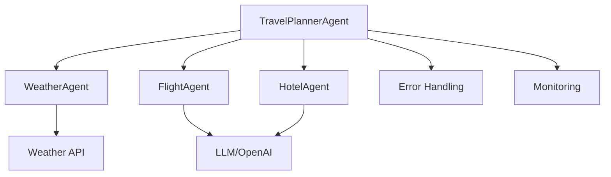
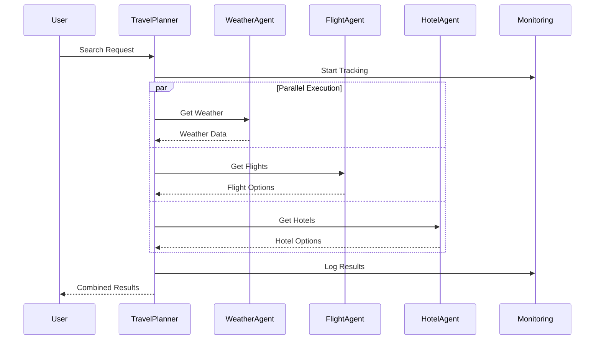

# AI Agent Observatory: Travel Planning Demo System 🤖

A demonstration project showcasing multi-agent AI system architecture, agent interactions, and monitoring capabilities. Uses a travel planning scenario to illustrate agent cooperation, error handling, and system observability.

[](https://www.python.org/downloads/)
[](https://openai.com/)
[](https://www.weatherapi.com/)
[](https://streamlit.io/)

## Agent System Architecture 🎯

This project demonstrates how multiple AI agents can work together in a coordinated system:



### Agent Roles and Interactions

1. **Orchestrator Agent** (`TravelPlannerAgent`)
   - Coordinates all sub-agents
   - Handles error propagation
   - Manages parallel execution
   - Consolidates results

2. **API Integration Agent** (`WeatherAgent`)
   - Interfaces with external weather API
   - Validates city names
   - Handles real-world data

3. **LLM-Powered Agents** (`FlightAgent`, `HotelAgent`)
   - Use OpenAI for simulated data generation
   - Structured output formatting
   - Context-aware responses

4. **Monitoring System**
   - Tracks agent interactions
   - Measures response times
   - Logs errors and validations
   - Provides observability

## Agent Communication Flow 🔄



## Educational Purpose ⚠️

**Note**: This is a demonstration project designed to illustrate:
- Multi-agent system architecture
- Agent communication patterns
- Error handling in distributed systems
- System monitoring and observability
- LLM integration techniques

**This is not a real travel planning system** - flight and hotel data are simulated using LLM for educational purposes.

## Key Learning Points 📚

1. **Agent Design Patterns**
   - Base agent abstraction
   - Specialized agent implementations
   - Agent coordination strategies

2. **Error Handling**
   - Graceful degradation
   - Error propagation
   - User feedback

3. **Monitoring Implementation**
   - Agent performance tracking
   - Error rate monitoring
   - System health metrics

4. **LLM Integration**
   - Structured prompt design
   - Response parsing
   - Error handling

## Installation 🛠️

1. Clone the repository:
```bash
git clone https://github.com/gpinaki/weather_agent_agentops.git
cd weather_agent_agentops
```

2. Create and activate virtual environment:
```bash
python -m venv weather-agent
source weather-agent/bin/activate  # On Windows: weather-agent\Scripts\activate
```

3. Install requirements:
```bash
pip install -r requirements.txt
```

4. Set up environment variables:
```bash
cp .env.example .env
# Edit .env with your API keys:
# OPENAI_API_KEY=your_openai_key
# WEATHER_API_KEY=your_weather_api_key
```

## Usage 💻

### Web Interface
```bash
streamlit run streamlit/app.py
```

### Command Line Interface
```bash
# Basic usage
python -m travel_planner

# Custom search
python -m travel_planner -o "London" -d "Paris" -D 2024-12-01

# See all options
python -m travel_planner --help
```
## Usage
See [USAGE.md](USAGE.md) for detailed usage instructions and examples.

## Project Structure 📁
```
travel_planner/
├── src/
│   └── travel_planner/
│       ├── __init__.py
│       ├── __main__.py        # CLI entry point
│       ├── agents/            # Core logic
│       ├── schemas/           # Data models
│       └── utils/             # Helpers
├── streamlit/                 # Web interface
├── requirements.txt
└── .env
```

## Technologies Used 🛠️

- **Python 3.10+**: Core programming language
- **OpenAI API**: Flight and hotel recommendations
- **WeatherAPI**: Real weather data
- **Streamlit**: Web interface
- **Pydantic**: Data validation
- **Plotly**: Data visualization
- **Colorama**: CLI formatting

## Contributing 🤝

Contributions are welcome! Please feel free to submit a Pull Request. For major changes, please open an issue first to discuss what you would like to change.

## Getting API Keys 🔑

1. **OpenAI API Key**:
   - Sign up at [OpenAI](https://openai.com/)
   - Create an API key in your dashboard
   - Add to `.env` file

2. **WeatherAPI Key**:
   - Register at [WeatherAPI](https://www.weatherapi.com/)
   - Get your API key
   - Add to `.env` file

## Future Improvements 🚀

- [ ] Add more travel services
- [ ] Implement caching
- [ ] Add more analytics
- [ ] Support more cities
- [ ] Add trip planning features
- [ ] Enhance error handling
- [ ] Add unit tests

## License 📄

This project is licensed under the MIT License - see the [LICENSE](LICENSE) file for details.

## Acknowledgments 🙏

This project was developed by Pinaki Guha, with supplementary support from AI-based code assistance tools like ChatGPT, Claude, and GitHub Copilot, to streamline specific parts of the development process.

## Contact 📧

Pinaki Guha - [pinaki.guha@gmail.com](mailto:pinaki.guha@gmail.com)

Project Link: [https://github.com/gpinaki/weather_agent_agentops](https://github.com/gpinaki/weather_agent_agentops)
